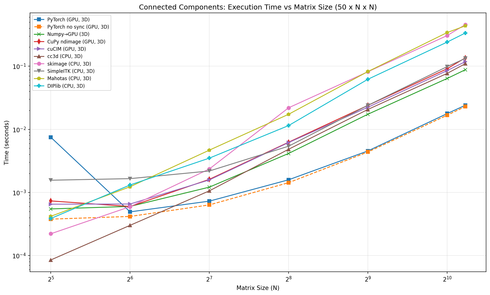
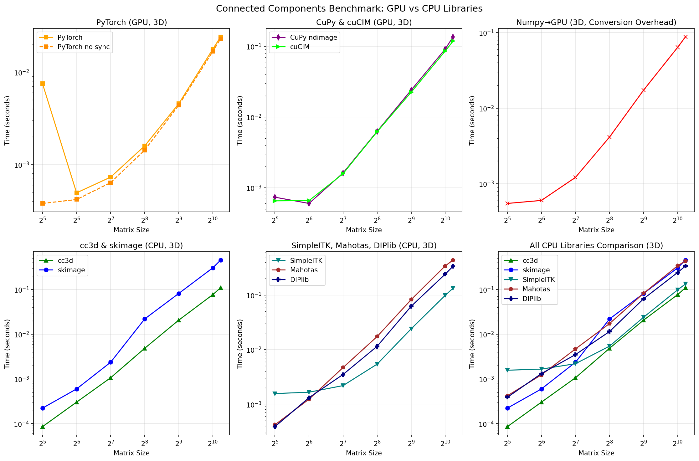

# GPU Connected Components Benchmark

Benchmarking connected component labeling libraries across CPU and GPU implementations.

Suggested to me by my advisor @tvercaut

## Benchmarked Libraries (Native 3D Only)

| Library | Backend | 3D Support |
|---------|---------|------------|
| PyTorch (cuCIM) | GPU | Native 3D |
| CuPy ndimage | GPU | Native 3D |
| cuCIM | GPU | Native 3D |
| cc3d | CPU | Native 3D |
| scikit-image | CPU | Native 3D |
| SimpleITK | CPU | Native 3D |
| Mahotas | CPU | Native 3D |
| DIPlib | CPU | Native 3D |

## Results





## Installation

Requires Python 3.9-3.12.

```bash
# Using uv (recommended)
uv venv --python 3.11
uv sync

# Install GPU support (CUDA 11.x)
uv pip install torch --index-url https://download.pytorch.org/whl/cu118
uv pip install cupy-cuda11x cucim

# OR for CUDA 12.x
uv pip install torch --index-url https://download.pytorch.org/whl/cu121
uv pip install cupy-cuda12x cucim
```

## Usage

```bash
# Run benchmark via CLI
uv run benchmark-cc

# Or as module
uv run python -m gpu_cc.benchmark
```

## Project Structure

```
├── src/
│   └── gpu_cc/
│       ├── __init__.py
│       ├── gpu_wrapper.py
│       └── benchmark.py
├── plots/
├── pyproject.toml
├── uv.lock
└── README.md
```

## Dependencies

**Base (CPU, native 3D only):**
- numpy, matplotlib
- scikit-image, connected-components-3d (cc3d)
- SimpleITK, mahotas, diplib

**GPU (native 3D only):**
- torch (with CUDA)
- cupy-cuda11x or cupy-cuda12x
- cucim
